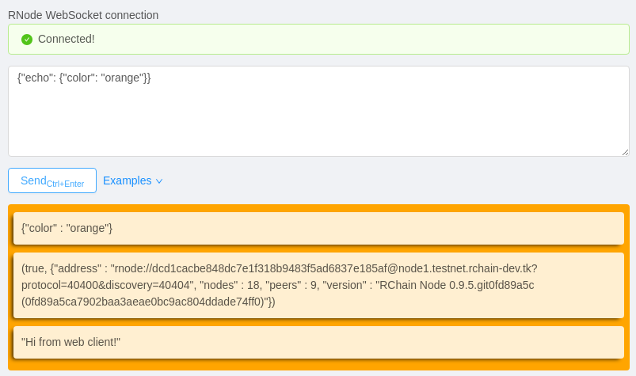

# Rholang experimental

**Demo** (part of RNode testing session): https://youtu.be/XjHblsOQuOk?t=3339

RNode is built from this commit (official version will not work):
https://github.com/tgrospic/rchain/tree/http-proc

## 1. Start web server for static site _http://localhost:1234_ (with Parcel)

This is the WebSocket client UI. WS messages can be also sent from terminal with `node client` CLI. 

```sh
cd js

# Download all js dependencies
npm i

npm start
```

## 2. Start nodejs web server with attached WebSocket endpoint

This starts nodejs _express_ web server with WebSocket connection. Output will show each HTTP request from RNode made with additional system process `rho:io:http`.

```sh
node server
```

## 3. Start long-polling contract on RNode

Rholang code will make long running HTTP requests to nodejs server. For each message or timeout error it will receive a response and reconnect. Messages are printed on RNode output.

_Note:_ to stop the long-polling on RNode either send `EXIT` message form WS client (UI) or stop the nodejs server.

```sh
# ... from js folder
rnode eval ../http_long_polling.rho
```

WS messaages (via RNode http) can be also sent from RNode REPL. Helper scripts is to create one-liner for REPL execution `http_socket.rho`.

```
@"ws"!({"color": "green"})
```

## Examples

Some useful examples are next to the `Send` button.


